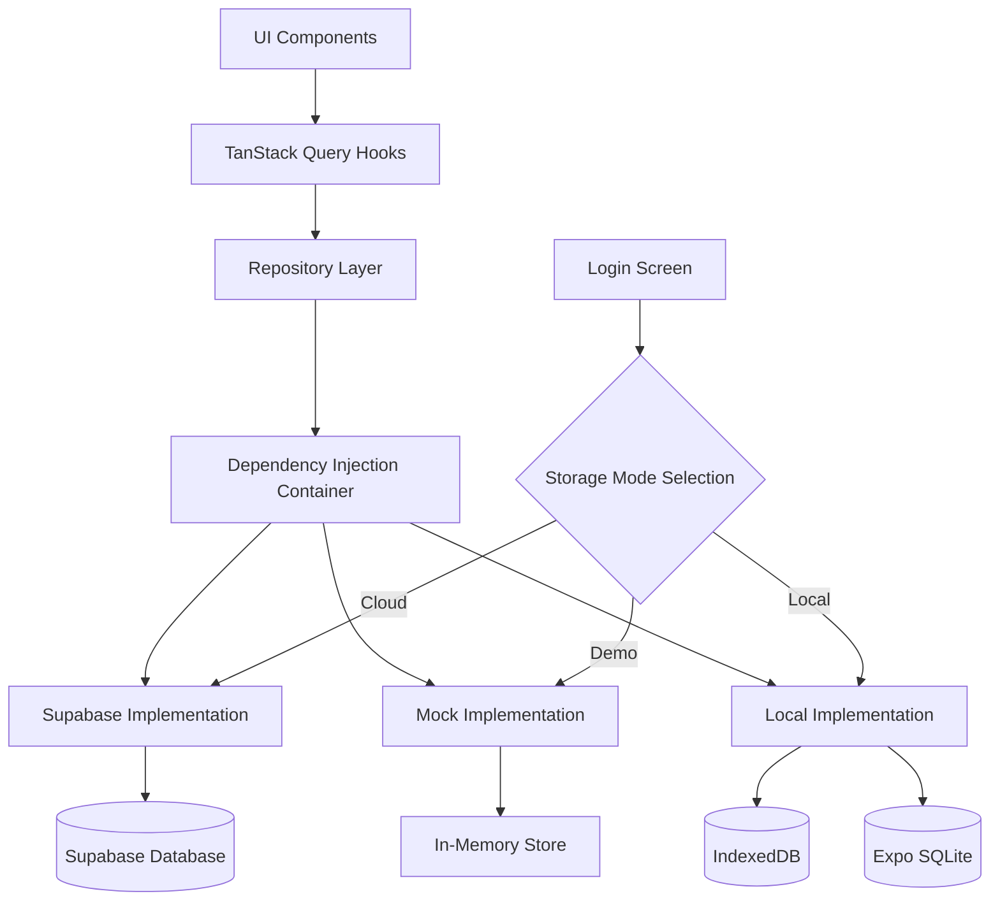

# Budgeteer Multi-Tier Storage Architecture Documentation

Welcome to the comprehensive documentation for Budgeteer's multi-tier storage architecture. This documentation covers the complete implementation of a flexible data access system that supports three distinct storage modes: Cloud (Supabase), Demo (Mock), and Local (IndexedDB/SQLite).

## Documentation Structure

### 📚 Core Documentation
- **[Architecture Overview](./architecture/README.md)** - High-level system design and architecture patterns
- **[Storage Modes](./storage-modes/README.md)** - Detailed guide to each storage implementation
- **[Developer Guide](./developer-guide/README.md)** - How to work with and extend the storage system
- **[Migration Guide](./migration/README.md)** - Migrating from the previous architecture

### 🔧 Implementation Guides
- **[Adding New Storage Implementations](./developer-guide/adding-storage-implementations.md)** - Step-by-step guide for new storage backends
- **[Usage Examples](./examples/README.md)** - Practical examples for each storage mode
- **[Testing Guide](./testing/README.md)** - Testing strategies and validation frameworks

### 📖 Reference
- **[API Reference](./api/README.md)** - Complete API documentation
- **[Error Handling](./error-handling/README.md)** - Error types and handling strategies
- **[Performance Guide](./performance/README.md)** - Optimization and monitoring

## Quick Start

### For Users
1. **[Storage Mode Selection](./storage-modes/selection.md)** - Choose the right storage mode for your needs
2. **[Basic Usage](./examples/basic-usage.md)** - Get started with the storage system

### For Developers
1. **[Development Setup](./developer-guide/setup.md)** - Set up your development environment
2. **[Architecture Concepts](./architecture/concepts.md)** - Understand the core concepts
3. **[Integration Guide](./developer-guide/integration.md)** - Integrate with existing code

## Key Features

- ✅ **Three Storage Modes**: Cloud, Demo, and Local storage options
- ✅ **Unified Interface**: Same API across all storage implementations
- ✅ **Dependency Injection**: Clean, testable architecture
- ✅ **Referential Integrity**: Consistent data relationships across all modes
- ✅ **TanStack Query Integration**: Seamless caching and state management
- ✅ **Type Safety**: Full TypeScript support with schema validation
- ✅ **Error Handling**: Comprehensive error management and recovery
- ✅ **Testing Framework**: Automated validation and testing tools

## Architecture at a Glance

## Getting Help

- **Issues**: Report bugs and request features in the project repository
- **Documentation**: This documentation is continuously updated
- **Examples**: Check the [examples directory](./examples/) for practical implementations

## Contributing

See the [Developer Guide](./developer-guide/README.md) for information on contributing to the storage architecture.