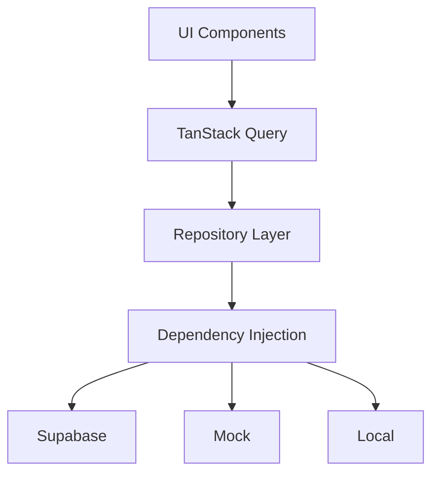

# Quick Start Guide

## Overview

This quick start guide helps you get up and running with Budgeteer's multi-tier storage architecture in minutes. Whether you're a new developer joining the project or an existing developer exploring the new architecture, this guide provides the essential information you need.

## 🚀 For Users

### Choosing Your Storage Mode

When you open Budgeteer, you'll see three storage options:

#### 🌐 Cloud Mode
- **Best for**: Regular use, multiple devices
- **Requires**: Account creation and internet connection
- **Benefits**: Data synced across devices, automatic backups

#### 🎮 Demo Mode  
- **Best for**: Trying out the app, demonstrations
- **Requires**: Nothing - instant access
- **Benefits**: Pre-loaded sample data, no commitment

#### 💾 Local Mode
- **Best for**: Privacy-focused users, offline use
- **Requires**: Nothing - works offline
- **Benefits**: Complete privacy, works without internet

### Getting Started
1. **Choose your storage mode** from the login screen
2. **For Cloud Mode**: Create an account or sign in
3. **For Demo/Local Mode**: Start using immediately
4. **Switch modes anytime** from the settings menu

## 👨‍💻 For Developers

### Quick Setup

```bash
# Clone and install
git clone <repository-url>
cd budgeteer
npm install

# Set up environment
cp .env.example .env
# Configure your Supabase credentials in .env

# Run the app
npm run web    # For web
npm run ios    # For iOS
npm run android # For Android
```

### Basic Usage

#### Working with Repositories
```typescript
import * as AccountsRepository from '@/src/services/apis/Accounts.repository';

// Get all accounts
const accounts = await AccountsRepository.getAllAccounts('tenant-id');

// Create new account
const newAccount = await AccountsRepository.createAccount({
  name: 'My Account',
  tenantid: 'tenant-id',
  categoryid: 'category-id',
  balance: 1000
});
```

#### Switching Storage Modes
```typescript
import { StorageModeManager } from '@/src/services/storage';

// Switch to local mode
await StorageModeManager.getInstance().setMode('local');

// Switch to demo mode
await StorageModeManager.getInstance().setMode('demo');
```

#### Using with React Components
```typescript
import { useQuery } from '@tanstack/react-query';
import * as AccountsRepository from '@/src/services/apis/Accounts.repository';

const AccountsList = ({ tenantId }) => {
  const { data: accounts, isLoading } = useQuery({
    queryKey: ['accounts', tenantId],
    queryFn: () => AccountsRepository.getAllAccounts(tenantId)
  });

  if (isLoading) return <div>Loading...</div>;
  
  return (
    <div>
      {accounts?.map(account => (
        <div key={account.id}>{account.name}: ${account.balance}</div>
      ))}
    </div>
  );
};
```

### Key Concepts

#### 1. Storage Modes
- **Cloud**: Supabase PostgreSQL database
- **Demo**: In-memory mock data
- **Local**: IndexedDB (web) or SQLite (native)

#### 2. Repository Pattern
- All data access goes through repositories
- Repositories use dependency injection
- Same interface across all storage modes

#### 3. Validation Framework
- Automatic referential integrity checking
- Consistent validation across all modes
- Custom validation rules supported

### Common Tasks

#### Adding a New Entity
1. **Define the interface** in `src/services/storage/types.ts`
2. **Implement providers** for each storage mode
3. **Create repository class** with dependency injection
4. **Add to provider factory** and repository manager
5. **Write tests** for all implementations

#### Testing Different Storage Modes
```typescript
describe('Cross-Storage Tests', () => {
  const modes = ['demo', 'local'] as const;
  
  modes.forEach(mode => {
    describe(`${mode} mode`, () => {
      beforeEach(async () => {
        await StorageModeManager.getInstance().setMode(mode);
      });
      
      it('should work with accounts', async () => {
        const accounts = await AccountsRepository.getAllAccounts('test');
        expect(Array.isArray(accounts)).toBe(true);
      });
    });
  });
});
```

#### Error Handling
```typescript
import { ValidationError, ReferentialIntegrityError } from '@/src/services/storage/errors';

try {
  await AccountsRepository.createAccount(accountData);
} catch (error) {
  if (error instanceof ValidationError) {
    console.error('Validation failed:', error.message);
  } else if (error instanceof ReferentialIntegrityError) {
    console.error('Referenced record not found:', error.details);
  }
}
```

## 🔧 Architecture Overview



### Key Components

- **Storage Mode Manager**: Manages current storage mode and providers
- **Repository Manager**: Provides repository instances with dependency injection
- **Validation Framework**: Ensures data integrity across all storage modes
- **Provider Factory**: Creates appropriate providers based on storage mode

## 📚 Essential Documentation

### For Users
- [Storage Modes Guide](./storage-modes/README.md) - Detailed guide to each storage mode
- [Migration Guide](./migration/README.md) - Migrating from previous versions

### For Developers
- [Developer Guide](./developer-guide/README.md) - Comprehensive development guide
- [API Reference](./api/README.md) - Complete API documentation
- [Architecture Overview](./architecture/README.md) - System design and patterns
- [Usage Examples](./examples/README.md) - Practical code examples

### For Contributors
- [Adding Storage Implementations](./developer-guide/adding-storage-implementations.md) - Add new storage backends
- [Testing Guide](./testing/README.md) - Testing strategies and frameworks

## 🆘 Common Issues & Solutions

### Issue: "Provider not found"
```typescript
// Solution: Ensure storage mode is set
await StorageModeManager.getInstance().setMode('demo');
```

### Issue: "Validation errors"
```typescript
// Solution: Check referential integrity
// Ensure referenced records exist before creating dependent records
```

### Issue: "TanStack Query not updating"
```typescript
// Solution: Invalidate queries after storage mode switch
queryClient.invalidateQueries();
```

### Issue: "Local storage not persisting"
```typescript
// Solution: Check browser storage settings and quotas
// For native apps, check file system permissions
```

## 🎯 Next Steps

### For New Users
1. **Try Demo Mode** to explore features
2. **Create Cloud Account** for regular use
3. **Use Local Mode** for privacy-focused scenarios

### For New Developers
1. **Read the Architecture Overview** to understand the system
2. **Explore the Examples** to see practical implementations
3. **Run the Tests** to understand expected behavior
4. **Try Adding a Feature** using the established patterns

### For Existing Developers
1. **Review Migration Guide** for upgrading existing code
2. **Explore New Capabilities** like local storage and enhanced validation
3. **Update Tests** to cover all storage modes
4. **Consider Refactoring** to take advantage of new architecture

## 💡 Tips & Best Practices

### For Users
- **Start with Demo Mode** to learn the interface
- **Use Cloud Mode** for your real financial data
- **Try Local Mode** when privacy is a concern
- **Export your data** regularly as backup

### For Developers
- **Always use repositories** instead of direct provider access
- **Test all storage modes** when developing features
- **Handle errors appropriately** using the provided error types
- **Follow the established patterns** when adding new functionality

### For Teams
- **Document customizations** when extending the system
- **Use the validation framework** to ensure data integrity
- **Write tests** for all storage modes
- **Keep documentation updated** as the system evolves

## 🔗 Quick Links

- **Main Documentation**: [docs/README.md](./README.md)
- **Architecture**: [docs/architecture/README.md](./architecture/README.md)
- **API Reference**: [docs/api/README.md](./api/README.md)
- **Examples**: [docs/examples/README.md](./examples/README.md)
- **Migration**: [docs/migration/README.md](./migration/README.md)

## 🤝 Getting Help

- **Documentation**: Check the comprehensive docs in this directory
- **Examples**: Look at practical examples in the examples folder
- **Issues**: Report bugs and request features in the project repository
- **Community**: Join discussions and ask questions

---

**Ready to get started?** Choose your path above and dive in! The multi-tier storage architecture provides a powerful, flexible foundation for building great financial management experiences.