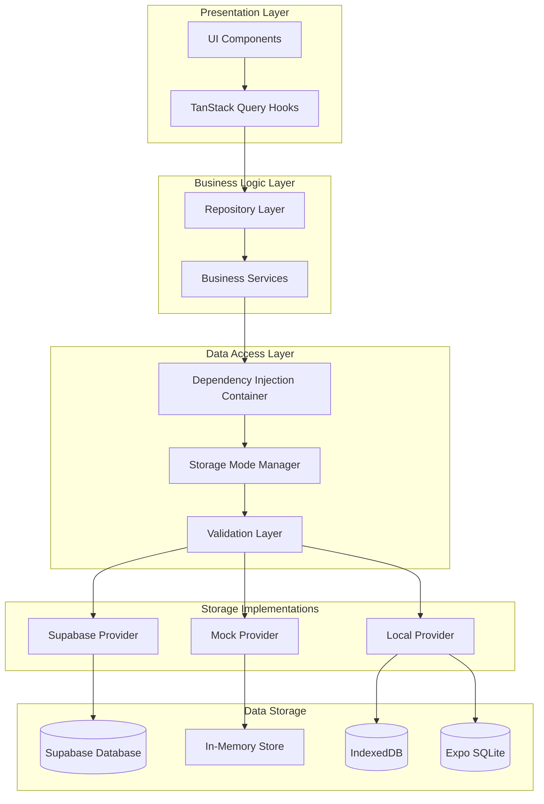
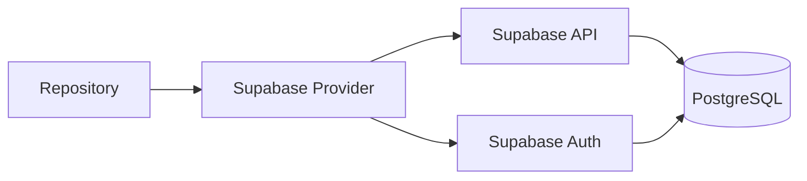
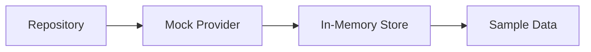
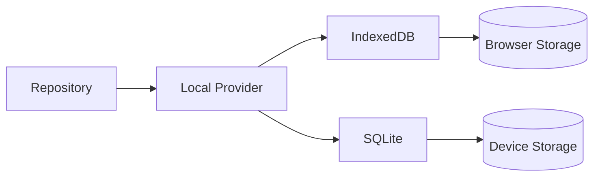

# Architecture Overview

## Introduction

The Budgeteer multi-tier storage architecture is designed to provide a flexible, maintainable, and scalable data access layer that supports multiple storage backends while maintaining a consistent interface and user experience.

## Core Principles

### 1. Interface Segregation
All storage implementations adhere to the same interface contracts, ensuring that switching between storage modes requires no changes to business logic or UI components.

### 2. Dependency Injection
The architecture uses dependency injection patterns to decouple storage implementations from business logic, making the system more testable and maintainable.

### 3. Schema Consistency
All storage modes enforce the same database schema and referential integrity rules, ensuring data consistency regardless of the underlying storage technology.

### 4. Backward Compatibility
The new architecture maintains full compatibility with existing TanStack Query hooks and UI components.

## High-Level Architecture

## Layer Responsibilities

### Presentation Layer
- **UI Components**: React Native components that display data and handle user interactions
- **TanStack Query Hooks**: Manage server state, caching, and data synchronization

### Business Logic Layer
- **Repository Layer**: Provides a clean interface for data operations, abstracting storage implementation details
- **Business Services**: Contains domain-specific business logic and orchestrates complex operations

### Data Access Layer
- **Dependency Injection Container**: Manages provider instances and handles dependency resolution
- **Storage Mode Manager**: Handles storage mode switching and provider lifecycle management
- **Validation Layer**: Enforces referential integrity and schema validation across all storage modes

### Storage Implementations
- **Supabase Provider**: Cloud-based storage using PostgreSQL
- **Mock Provider**: In-memory storage for demonstrations and testing
- **Local Provider**: Client-side persistent storage using IndexedDB (web) or SQLite (native)

## Key Components

### Storage Mode Manager
The `StorageModeManager` is the central component that:
- Manages the current storage mode
- Handles provider instantiation and cleanup
- Coordinates mode switching operations
- Provides provider instances to the dependency injection container

### Repository Pattern
Each entity has a dedicated repository that:
- Implements a consistent interface across all storage modes
- Handles data transformation and validation
- Provides a clean API for business logic
- Integrates seamlessly with TanStack Query

### Provider Interfaces
Standardized interfaces ensure that all storage implementations:
- Have identical method signatures
- Return consistent data structures
- Handle errors in a uniform manner
- Support the same feature set

### Validation Framework
A comprehensive validation system that:
- Enforces referential integrity across all storage modes
- Validates schema compliance
- Provides consistent error handling
- Supports cascade operations

## Storage Mode Architecture

### Cloud Mode (Supabase)

**Characteristics:**
- Production-ready cloud database
- Built-in authentication and authorization
- Real-time subscriptions
- Automatic scaling and backups

### Demo Mode (Mock)

**Characteristics:**
- No authentication required
- Pre-populated with sample data
- Fast response times
- Data resets on application restart

### Local Mode (IndexedDB/SQLite)

**Characteristics:**
- Persistent local storage
- Offline capability
- No network dependency
- Platform-specific implementations

## Data Flow

### Read Operations
1. UI component requests data through TanStack Query hook
2. Hook calls repository method
3. Repository delegates to current storage provider
4. Provider retrieves data from storage backend
5. Data flows back through the layers with caching at the TanStack Query level

### Write Operations
1. UI component initiates write operation
2. Repository validates data and business rules
3. Validation layer enforces referential integrity
4. Provider persists data to storage backend
5. TanStack Query cache is invalidated/updated
6. UI components re-render with updated data

### Mode Switching
1. User selects new storage mode
2. Storage Mode Manager initiates cleanup of current provider
3. New provider is instantiated and initialized
4. Repository instances are updated with new provider
5. TanStack Query cache is cleared
6. UI components re-render with data from new storage mode

## Benefits

### For Users
- **Flexibility**: Choose the storage mode that best fits their needs
- **Offline Support**: Local mode enables offline usage
- **Demo Experience**: Try the application without creating an account

### For Developers
- **Maintainability**: Clean separation of concerns and consistent interfaces
- **Testability**: Easy to mock and test individual components
- **Extensibility**: Simple to add new storage implementations
- **Type Safety**: Full TypeScript support with compile-time validation

### For the Application
- **Scalability**: Easy to add new storage backends as requirements evolve
- **Reliability**: Comprehensive error handling and validation
- **Performance**: Optimized for each storage backend's characteristics
- **Consistency**: Same behavior and data integrity across all modes

## Design Patterns Used

### Repository Pattern
Provides a uniform interface for data access operations, abstracting the underlying storage implementation.

### Dependency Injection
Enables loose coupling between components and makes the system more testable and maintainable.

### Factory Pattern
Used in provider creation and storage mode management to encapsulate object creation logic.

### Strategy Pattern
Different storage implementations represent different strategies for data persistence.

### Observer Pattern
TanStack Query and the validation system use observer patterns for cache invalidation and data synchronization.

## Next Steps

- [Storage Modes Guide](../storage-modes/README.md) - Learn about each storage implementation
- [Developer Guide](../developer-guide/README.md) - Start developing with the architecture
- [API Reference](../api/README.md) - Detailed API documentation