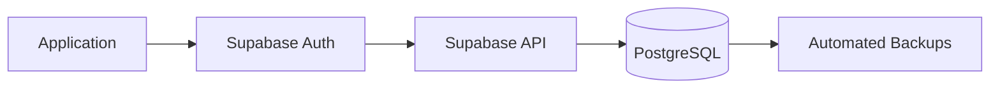
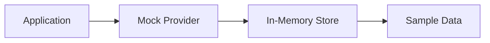
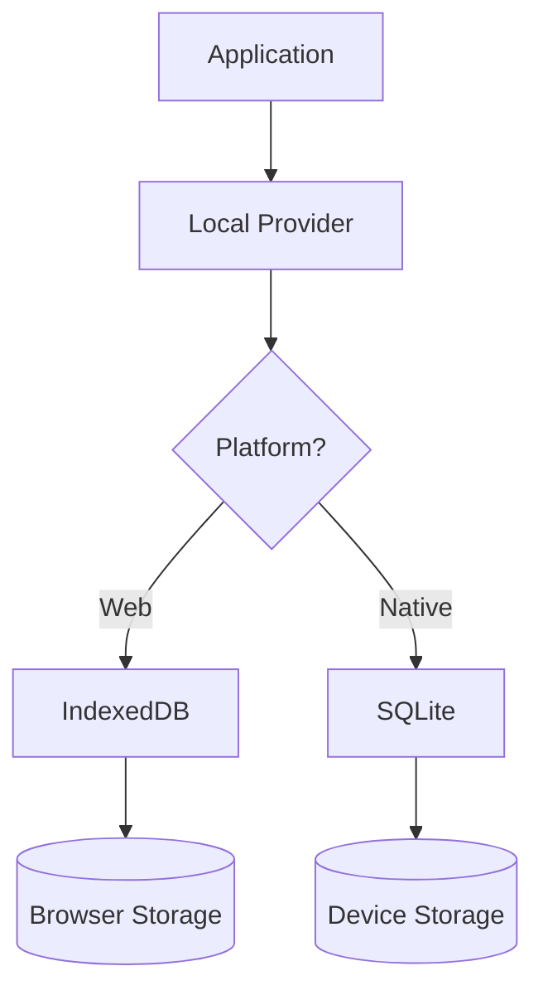

# Storage Modes Guide

## Overview

Budgeteer supports three distinct storage modes, each designed for different use cases and environments. All modes maintain the same user interface and functionality while using different underlying storage technologies.

## Storage Mode Comparison

| Feature | Cloud Mode | Demo Mode | Local Mode |
|---------|------------|-----------|------------|
| **Authentication** | Required | None | None |
| **Data Persistence** | Cloud Database | Session Only | Local Device |
| **Offline Support** | Limited | Full | Full |
| **Data Sharing** | Multi-device | None | Single Device |
| **Setup Required** | Account Creation | None | None |
| **Performance** | Network Dependent | Fast | Fast |
| **Storage Limit** | Cloud Limits | Memory Limits | Device Storage |

## Cloud Mode (Supabase)

### Overview
Cloud mode connects to a Supabase PostgreSQL database, providing full-featured cloud storage with authentication, real-time synchronization, and multi-device access.

### When to Use
- **Production Use**: For real financial data management
- **Multi-device Access**: When you need to access data from multiple devices
- **Data Backup**: When you want your data backed up in the cloud
- **Collaboration**: When multiple users need access to the same data

### Features
- ✅ User authentication and authorization
- ✅ Real-time data synchronization
- ✅ Automatic backups and disaster recovery
- ✅ Multi-device synchronization
- ✅ Row-level security
- ✅ Advanced querying capabilities

### Technical Details
```typescript
// Cloud mode configuration
const cloudConfig = {
  mode: 'cloud' as const,
  requiresAuth: true,
  provider: 'supabase',
  features: {
    realtime: true,
    multiDevice: true,
    backup: true,
    sharing: true
  }
};
```

### Setup Requirements
1. **Supabase Account**: Create an account at [supabase.com](https://supabase.com)
2. **Environment Variables**: Configure Supabase URL and API key
3. **User Registration**: Users must create accounts to access their data

### Data Flow


## Demo Mode (Mock)

### Overview
Demo mode uses in-memory storage with pre-populated sample data, perfect for demonstrations, testing, and trying out the application without commitment.

### When to Use
- **First-time Users**: Exploring the application features
- **Demonstrations**: Showing the application to others
- **Development**: Testing new features
- **Offline Demos**: When internet connectivity is unavailable

### Features
- ✅ No authentication required
- ✅ Pre-populated sample data
- ✅ Fast response times
- ✅ Full feature access
- ✅ Safe environment for experimentation
- ❌ Data resets on app restart

### Technical Details
```typescript
// Demo mode configuration
const demoConfig = {
  mode: 'demo' as const,
  requiresAuth: false,
  provider: 'mock',
  features: {
    sampleData: true,
    fastResponse: true,
    noNetwork: true,
    resetOnRestart: true
  }
};
```

### Sample Data Included
- **Accounts**: Checking, Savings, Credit Card accounts
- **Categories**: Common expense and income categories
- **Transactions**: 3 months of realistic transaction history
- **Budgets**: Pre-configured budget categories
- **Recurring**: Sample recurring transactions

### Data Flow


## Local Mode (IndexedDB/SQLite)

### Overview
Local mode stores data persistently on the user's device using IndexedDB for web browsers and SQLite for native mobile applications.

### When to Use
- **Privacy Concerns**: When you want complete data privacy
- **Offline Usage**: When internet connectivity is unreliable
- **Personal Use**: For single-device personal finance management
- **Data Control**: When you want full control over your data

### Features
- ✅ Complete offline functionality
- ✅ Data persists across app restarts
- ✅ No network dependency
- ✅ Fast local access
- ✅ Complete privacy
- ❌ No multi-device synchronization

### Technical Details

#### Web Implementation (IndexedDB)
```typescript
// IndexedDB configuration
const webLocalConfig = {
  mode: 'local' as const,
  platform: 'web',
  storage: 'indexeddb',
  database: 'BudgeteerDB',
  version: 1
};
```

#### Native Implementation (SQLite)
```typescript
// SQLite configuration
const nativeLocalConfig = {
  mode: 'local' as const,
  platform: 'native',
  storage: 'sqlite',
  database: 'budgeteer.db',
  location: 'default'
};
```

### Storage Specifications

#### IndexedDB (Web)
- **Database**: BudgeteerDB
- **Storage Location**: Browser's IndexedDB
- **Capacity**: Typically 50MB+ (browser dependent)
- **Persistence**: Survives browser restarts, may be cleared by browser cleanup

#### SQLite (Native)
- **Database**: budgeteer.db
- **Storage Location**: App's document directory
- **Capacity**: Limited by device storage
- **Persistence**: Permanent until app is uninstalled

### Data Flow


## Storage Mode Selection

### Login Screen Integration
The enhanced login screen presents three clear options:

```typescript
const storageOptions = [
  {
    id: 'cloud',
    title: 'Login with Username and Password',
    description: 'Connect to cloud database with full sync',
    icon: 'cloud',
    requiresAuth: true,
    benefits: ['Multi-device sync', 'Cloud backup', 'Real-time updates']
  },
  {
    id: 'demo',
    title: 'Demo Mode',
    description: 'Try the app with sample data',
    icon: 'play-circle',
    requiresAuth: false,
    benefits: ['No signup required', 'Instant access', 'Sample data included']
  },
  {
    id: 'local',
    title: 'Local Mode',
    description: 'Store data locally on your device',
    icon: 'database',
    requiresAuth: false,
    benefits: ['Complete privacy', 'Offline access', 'No internet required']
  }
];
```

### Mode Switching
Users can switch between storage modes at any time:

1. **From Settings**: Access storage mode settings
2. **Data Migration**: Option to export/import data between modes
3. **Seamless Transition**: UI remains consistent across modes

## Data Migration Between Modes

### Export/Import Functionality
```typescript
// Export data from current mode
const exportData = async () => {
  const data = await StorageModeManager.exportAllData();
  return JSON.stringify(data, null, 2);
};

// Import data to new mode
const importData = async (jsonData: string) => {
  const data = JSON.parse(jsonData);
  await StorageModeManager.importAllData(data);
};
```

### Migration Scenarios

#### Demo to Local
- Export sample data modifications
- Switch to local mode
- Import customized data

#### Local to Cloud
- Export local data
- Create cloud account
- Import data to cloud storage

#### Cloud to Local
- Export cloud data
- Switch to local mode
- Import data for offline use

## Performance Characteristics

### Response Times (Typical)
- **Demo Mode**: < 1ms (in-memory)
- **Local Mode**: 1-10ms (local storage)
- **Cloud Mode**: 50-500ms (network dependent)

### Storage Capacity
- **Demo Mode**: Limited by device RAM
- **Local Mode**: Limited by device storage
- **Cloud Mode**: Limited by cloud plan

### Offline Capabilities
- **Demo Mode**: Full offline support
- **Local Mode**: Full offline support
- **Cloud Mode**: Limited offline support (cached data only)

## Best Practices

### Choosing the Right Mode
1. **Start with Demo**: New users should try demo mode first
2. **Local for Privacy**: Use local mode for sensitive personal data
3. **Cloud for Convenience**: Use cloud mode for multi-device access

### Data Management
1. **Regular Exports**: Export data regularly as backup
2. **Mode Switching**: Test features in demo mode before switching
3. **Storage Monitoring**: Monitor local storage usage

### Development
1. **Test All Modes**: Ensure features work across all storage modes
2. **Mock Data**: Use demo mode for development and testing
3. **Performance Testing**: Test performance characteristics of each mode

## Troubleshooting

### Common Issues
- **Cloud Mode**: Network connectivity, authentication failures
- **Demo Mode**: Data loss on restart (expected behavior)
- **Local Mode**: Storage quota exceeded, browser cleanup

### Solutions
- **Network Issues**: Check internet connection and Supabase status
- **Storage Issues**: Clear browser data or check device storage
- **Authentication**: Reset password or check credentials

## Next Steps

- [Developer Guide](../developer-guide/README.md) - Learn to work with storage modes
- [Usage Examples](../examples/README.md) - See practical implementations
- [Migration Guide](../migration/README.md) - Migrate from previous architecture